<p align="center">
  
</p>

<p align="center">
  <a href="https://salvage-alpha.vercel.app"><b>Live demo</b></a>
  &nbsp;&#183;&nbsp;
  <a href="docs/RESULTS.md">Results</a>
  &nbsp;&#183;&nbsp;
  <a href="docs/WHAT_BROKE.md">What broke</a>
  &nbsp;&#183;&nbsp;
  <a href="docs/AUDIT.md">Audit</a>
  &nbsp;&#183;&nbsp;
  <a href="docs/02_TECHNICAL_ARCHITECTURE.md">Architecture</a>
</p>

<p align="center">
  
  
  
  
  
</p>

---

A payment gateway does not usually fail all at once. It fails in a corner. One UPI handle starts
declining, or one card BIN range, or one bank's netbanking, and the merchant's overall success rate
moves two points, which nobody notices for an hour. In that hour a large store loses a few hundred
orders, and the customers behind them have already closed the tab.

The recovery that happens today is undifferentiated: send everyone who failed a payment link, a few
hours later, and hope. It works, partly, because a second chance to pay is worth something no matter
why the first one failed. But it is a blunt instrument aimed with no information. It messages
customers whose rail is still broken, it messages customers about faults they cannot do anything
about, and it treats a thousand messages a day as free.

Salvage detects the failing segment, works out why, chooses the smallest safe intervention, recovers
only where recovery is justified, and escalates when it is not.

---

## The loop



Escalate is not a step on the way to recovery. It is where a case ends when the agent decides a human
should take it, and the system is built so nothing can run from there.

---

## Detection

Deterministic, no model. Success rates are tracked per segment on 15 minute sliding windows against
each segment's own baseline, across a hierarchy from the merchant down to a single UPI handle or card
BIN. An incident opens when four conditions hold in two consecutive windows: at least 20 attempts, an
absolute excess of 15 points over baseline, a binomial p-value under 0.001 with a Bonferroni
correction, and persistence.

Attribution walks to the coarsest key that explains the failures, so a gateway-wide fault produces one
incident rather than twenty.

The thresholds were frozen after calibration on a single seed and never touched again. Every number
below was measured against seeds the thresholds had never seen.

---

## Diagnosis



The evidence packet contains counts, rates, error distributions and five sample error strings. No
names, no contacts, no per-customer amounts. It is built to be safe to publish, and a test enforces
that.

The model proposes. It has no tools, its output is a JSON object validated against a schema, and it
cannot call Razorpay, the database or the message channel.

---

## The gate



Every action is checked before it happens, not after, and every rule's verdict is written to the
ledger with the sentence the engine produced when it made the call.

The bounds are in code, and none of them depend on the model behaving:

| Bound | Rule |
|---|---|
| One open link per order | cancelled if the order is paid any other way |
| Two nudges per customer per incident | three per rolling seven days across incidents |
| Consent required | opt-out honoured immediately and permanently |
| Quiet hours 21:00 to 09:00 IST | sends are queued, not cancelled |
| Never nudge into a still-failing rail | converts to defer instead |
| Hard declines | no retry, no link |
| 72 hour order TTL | then abandoned |
| Circuit breaker | pauses and escalates |
| Kill switch | one environment variable, detection keeps running |

The action schema has no amount field. `SEND_RECOVERY_LINK` carries a case id, and the executor reads
the order amount from the database, so there is no code path anywhere that takes an amount from model
output.

---

## Results



Five scenarios, ten seeds, five policy arms, 250 runs. Every arm faces byte-identical worlds for a
given seed, proven by a stream digest, and the at-risk order set is identical across arms by
construction.

| Scenario | At-risk orders | Agent | Echo | B0 none | B1 immediate | B2 timed |
|---|---|---|---|---|---|---|
| S0 no fault | 0 | 0 / 0 | 0 / 0 | 0 / 0 | 0 / 0 | 0 / 0 |
| S1 issuer outage | 262 | **2,21,154 / 83** | 2,37,221 / 131 | 93,947 / 0 | 1,47,797 / 165 | 1,75,050 / 261 |
| S2 card BIN auth | 153 | **1,20,065 / 44** | 1,13,983 / 29 | 50,095 / 0 | 79,263 / 88 | 93,255 / 140 |
| S3 gateway | 551 | 4,78,668 / 422 | 4,63,403 / 379 | 3,01,760 / 0 | 4,20,743 / 312 | 4,72,828 / 492 |
| S4 merchant config | 300 | 90,128 / 0 | 90,128 / 0 | 90,128 / 0 | 1,57,696 / 178 | 1,65,041 / 272 |

Rupees recovered / messages sent, mean of 10 seeds, at-risk order set.

**The thesis is not that the agent recovers more money.** Across the whole day the agent recovers 29 to 44
percent less than the best baseline, which gets there by messaging roughly a thousand customers whose
failures have nothing to do with any incident. This simulator charges almost nothing for a message beyond a 2.6
percent chance of an opt-out, which flatters the baselines rather than the agent.

The thesis is that Salvage recovers the revenue actually attributable to an incident without spraying
recovery attempts across the merchant's entire customer base. On S1 that is 26 percent more money from
32 percent of the contacts. On S4 it is nothing at all, on purpose.

The S1 and S2 margins rest on a steer conversion constant that was swept from 0.25 to 0.65 with the
agent included. The margin narrows by about three quarters across that range and never closes.

---

## Where it stops working



The most useful thing this project found is the boundary of its own competence. Nothing was tuned
against these results; the thresholds were frozen before the off-peak variant existed.

---

## The ledger



There is no update or delete path against the ledger table anywhere in the codebase, and a test greps
the source to keep it that way. A property test mutates a random byte of a random entry and asserts
verification fails.

---

## Honest findings

Three results cut against the project and are reported here rather than in an appendix.

**The language model did not detectably contribute to recovery on this workload.** An arm whose model
is replaced by a stub repeating the rules classifier performs the same: signs disagree across
scenarios, no scenario clears a paired t, and the four sum to roughly minus five thousand rupees. Every
incident the rules get wrong they get wrong by answering `unknown`, and unknown escalates either way.
The gate works in one direction only: being confidently wrong is caught and costs nothing, being right
beyond the threshold buys nothing at 41 incidents. Two honest reasons it could differ elsewhere: the
rules classifier was written against these exact five scenarios, and 41 incidents cannot resolve a small
effect.

**S3 is a tie, not a win.** 5,840 rupees on a paired standard deviation of 15,993, and the agent is
behind on 1 of the 10 seeds. On a merchant-wide gateway fault every method is degraded, so there is
nothing to steer toward and cause-awareness has little to act on.

**Two of the five scenarios key on fields production payloads may not carry.** S2 keys on `card_bin6`
and S1 on `upi_handle`, and neither is guaranteed by the payloads Razorpay documents. It affects no
number here, because the simulator emits both and every arm faces the same payloads, but the segment
keys would need re-deriving against real traffic first, and that work is not done.

---

## What is not measured

No Razorpay account was created and **no live API call was made**. All Razorpay interaction is
exercised against contract tests built from documented request and response shapes, and webhook
signature verification is proven against a known secret. That proves the client builds correct requests
and parses documented responses. It does not prove behaviour against the live service, including
undocumented fields, rate limiting and real error responses.

`scripts/e2e_real_link.py` is written, refuses to run without credentials, and has not been run.

---

## What broke

Most of what broke in this build produced a number rather than a crash, and the test suite was green
through almost all of it.

- A no-action baseline that was measuring itself, because organic recovery was computed after the agent ran.
- Policies that could see the future, testing `orders.status == 'paid'` over a completed simulation, and so declining to act on exactly the customers about to pay anyway.
- Baselines handed the agent's steering for free, because the channel named an alternate method for every policy.
- Rail state read from the detector's incidents, so a baseline's outcome depended on the agent's detector.
- A validator that rejected well-formed model output for a superficial reason. On the misconfiguration scenario the model diagnosed correctly and planned an escalation but wrote its reasoning in the wrong field; the validator threw the action away, the plan came back empty, and a completed 200 run sweep reported the resulting silence as principled restraint.

The full list, ordered by cost, is in [docs/WHAT_BROKE.md](docs/WHAT_BROKE.md). An independent adversarial
audit of the repository is in [docs/AUDIT.md](docs/AUDIT.md), including the findings that went against
the project.

---

## Running it

System Python 3.14 is externally managed, so the project pins a uv-managed interpreter.

```bash
uv python install 3.12
uv venv --python 3.12 && source .venv/bin/activate
uv sync
cp .env.example .env          # optional: Razorpay test keys, Gemini key

uv run salvage db migrate
uv run salvage sim run --scenario S1 --seed 1
uv run salvage detect calibrate --seeds 0..4
uv run salvage agent run --scenario S2 --seed 1 --provider fixture
uv run salvage eval run --scenarios S0,S1,S2,S3,S4 --seeds 0..9
uv run salvage ledger verify
uv run salvage serve                       # 127.0.0.1:8000
```

```bash
cd web && npm install && npm run dev        # 127.0.0.1:5173
```

A production build ships only the two pages that need no backend, the Scenario Runner and Results,
because the other five read a live FastAPI process and five error panels are a worse first impression
than five absent pages. Deploying to Vercel, from the repository root:

```bash
npx vercel --cwd web            # preview, prints the URL
npx vercel --prod --cwd web     # production
```

Importing the repository from the Vercel dashboard instead needs nothing configured: the root
`vercel.json` sends the build into `web/`, and `.vercelignore` keeps the Python project out of the
upload so Vercel does not find `pyproject.toml` and try to build a FastAPI app.

The test suite runs with no network and no credentials:

```bash
SALVAGE_LLM_PROVIDER=fixture uv run pytest -q
```

---

## Layout

```
salvage/
  detect/      segments, sliding windows, incident open and close
  diagnose/    evidence packet, rules classifier, model, reconciliation
  decide/      action menu, planner, policy engine
  execute/     Razorpay client, per-order state machine, channel, scheduler
  sim/         merchant fixture, traffic, faults, response model, params.yaml
  eval/        baselines, metrics, sweeps, report
  llm/         provider abstraction, cache, fixtures
  ledger.py    append only, hash chained
web/           Vite, React, TypeScript, the console and the replay
docs/          PRD, architecture, security, frontend spec, results, audit, what broke
```

Four design documents were written before any code and are submitted as written, with their own
divergences recorded rather than retrofitted:
[PRD](docs/01_PRD.md) &#183;
[Architecture](docs/02_TECHNICAL_ARCHITECTURE.md) &#183;
[Security and access](docs/03_SECURITY_AND_ACCESS.md) &#183;
[Frontend spec](docs/04_FRONTEND_SPEC.md)

---

<p align="center">
  <sub>Salvage claims no TRAI, RBI or PCI compliance. It follows the spirit of consent, quiet hours and opt-out, and says so.</sub>
</p>
