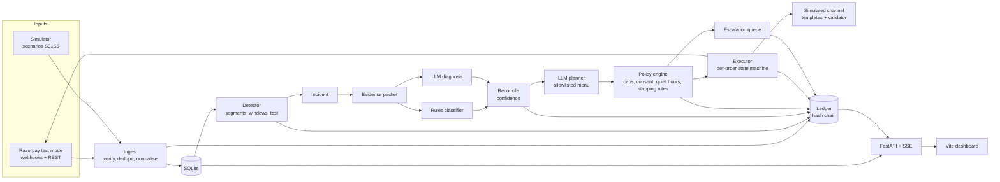
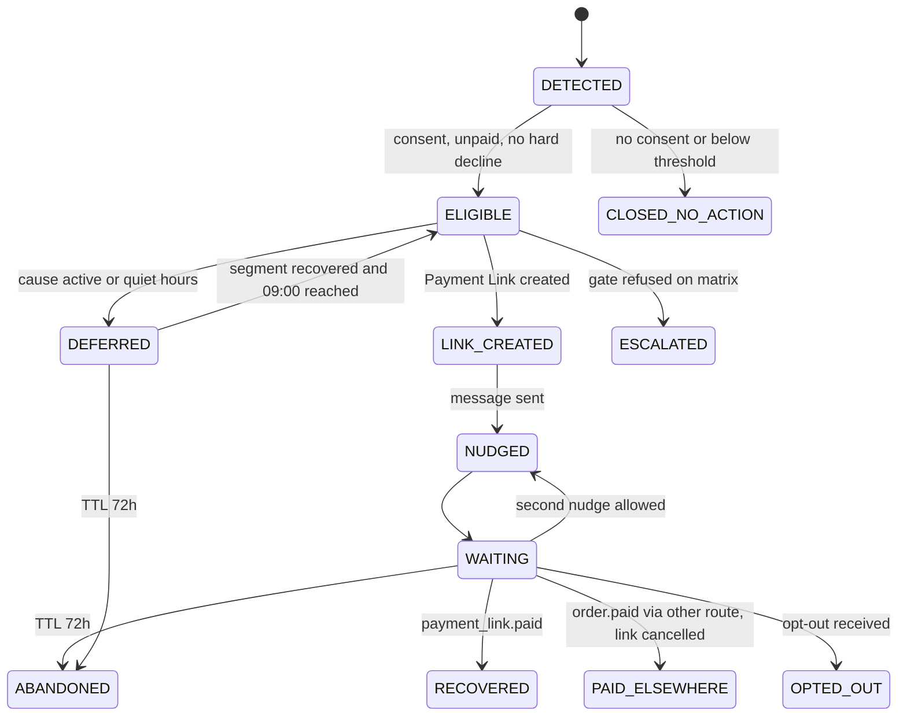

# Salvage: Technical Architecture

Version 0.1, 24 August 2026. Companion to `01_PRD.md`. Everything here is a build decision; open items are listed at the end.

## 1. Overview

Salvage is a single Python service (FastAPI) with an in-process scheduler, a SQLite database, a Vite dashboard, and a simulator that doubles as the evaluation harness. Razorpay test mode is used for real objects (Orders, Payment Links, webhooks); payment attempts in the batch are simulated events shaped exactly like Razorpay's payment entity and webhook payloads.



Design rules that shaped everything:

- Determinism where money moves. Detection, policy, execution and the ledger contain no model calls. The LLM proposes; code decides and acts.
- The model is called at incident level only. A full evaluation run makes tens of LLM calls, never one per order.
- One process, one file database. The laptop has about 11 GB of usable RAM and has already OOM-killed VS Code once. No containers, no Postgres, no Redis, no Next.js.
- The simulator is the instrument. Its parameters are data, not code.

## 2. Components

| Component | Package | Responsibility |
|-----------|---------|----------------|
| Ingest | `salvage/ingest` | Webhook endpoint with signature verification and dedupe; record and replay tool; normalisation of Razorpay payloads and simulator events into the `payment_attempts` table |
| Simulator | `salvage/sim` | Merchant fixture, traffic generator, fault scenarios, customer response model, ground truth, sim clock |
| Detector | `salvage/detect` | Segment keys, sliding windows, baseline, statistical test, incident open and close, at-risk revenue |
| Diagnosis | `salvage/diagnose` | Evidence packet builder, rules classifier, LLM diagnosis, confidence reconciliation |
| Decision | `salvage/decide` | Action menu and schemas, LLM planner, policy engine (matrix, caps, consent, quiet hours, stopping rules, circuit breaker) |
| Executor | `salvage/execute` | Razorpay client with retries and idempotency, per-order state machine, simulated channel, templates and validator, scheduler |
| LLM | `salvage/llm` | Provider abstraction (Gemini, Ollama, fixture), response cache, fixture recorder |
| Ledger | `salvage/ledger.py` | Append-only hash-chained log, JSONL export, verification |
| Evaluation | `salvage/eval` | Baselines, metrics, runner producing `results.json` and `docs/RESULTS.md` |
| API | `salvage/api` | FastAPI routers, SSE stream, storefront endpoints |
| Dashboard | `web/` | Vite, React, TypeScript, Tailwind |

## 3. Data model

SQLite, WAL mode, one file at `data/salvage.db`. Schema managed by numbered SQL migration files applied at startup. Amounts are integers in paise. Timestamps are integer Unix seconds in the sim clock (real clock when ingesting real webhooks).

| Table | Key columns |
|-------|-------------|
| `customers` | id, ref_hash, consent (bool), locale (en, hi_en), preferred_method, upi_handle, card_bin, card_network, card_issuer, nb_bank, typical_amount, opted_out_at |
| `orders` | id (Razorpay order id or sim id), customer_id, amount, currency, status (created, attempted, paid, abandoned), source (sim, razorpay), created_at, paid_at |
| `payment_attempts` | id, order_id, customer_id, method, upi_handle, card_bin, card_network, card_issuer, nb_bank, status (failed, authorized, captured), error_code, error_source, error_step, error_reason, error_description, created_at, raw_json, truth_cause (sim only, never shown to the agent) |
| `segments_stats` | segment_key, window_start, attempts, failures, baseline_rate, p_value |
| `incidents` | id, segment_key, opened_at, closed_at, at_risk_amount, rules_cause, llm_cause, root_cause, confidence, plan_json, status (open, escalated, paused, recovering, closed) |
| `recovery_cases` | id, order_id, customer_id, incident_id (nullable), state, attempts, link_id, link_url, next_action_at, ttl_at, outcome, updated_at |
| `actions` | id, case_id, incident_id, type, params_json, gate_json, status, rzp_request_id, rzp_response_json, executed_at |
| `escalations` | id, incident_id, reason, evidence_json, proposed_action_json, decision, decided_at |
| `customer_comms` | id, customer_id, case_id, incident_id, channel, template_id, locale, body_hash, sent_at |
| `webhook_events` | event_id (unique), received_at, verified, raw_json |
| `llm_cache` | prompt_hash, provider, model, response_json, created_at |
| `ledger` | seq, ts, kind, ref_type, ref_id, payload_json, prev_hash, hash |
| `checkout_hints` | segment_key, hide_json, sequence_json, active_from, active_to |

The `truth_cause` column and the simulator's ground-truth tables are readable only by the evaluation runner. The agent's code paths query views that exclude them.

## 4. Ingest

Real webhooks: `POST /api/webhooks/razorpay`. Read the raw body, compute HMAC-SHA256 with the webhook secret, compare in constant time against `X-Razorpay-Signature`, then dedupe on `X-Razorpay-Event-Id` (unique index on `webhook_events.event_id`). Verified events are normalised into `payment_attempts`, `orders` and link outcomes. Events handled: `payment.failed`, `payment.captured`, `order.paid`, `payment_link.paid`, `payment_link.cancelled`, `payment_link.expired`.

Record and replay: `salvage webhooks record` writes every verified raw event to `data/webhooks/*.json`; `salvage webhooks replay <dir>` feeds them back through the same normaliser with a fake signature header accepted only when `SALVAGE_ENV=dev`.

Simulated events are produced by the simulator in the same shape (payment entity fields, including `error_code`, `error_source`, `error_step`, `error_reason`, `error_description`, `method`, `vpa`, `card.network`, `card.issuer`, `card.iin`, `bank`) and go through the same normaliser, so the detector cannot tell the two sources apart.

## 5. Detector

Segment keys are computed for every attempt: `method`, `method:upi_handle`, `method:card_network`, `method:card_issuer`, `method:card_bin6`, `method:nb_bank`, and `error_step` crossed with `method`. Statistics are kept per key.

Window: 15 simulated minutes, evaluated every minute. Baseline per key: failure rate over the trailing seven days at the same hour band (four bands per day), falling back to the key's overall trailing rate when the band has fewer than 200 attempts, then to the method-level rate.

Test, per key per window:

1. `n >= 20` attempts in the window.
2. Observed failure rate `p` minus baseline `p0` at least 0.15 absolute.
3. One-sided binomial test of `k` failures in `n` against `p0`, p-value below 0.001 (Bonferroni across the number of live keys, capped at 0.0001).
4. Conditions 1 to 3 hold in two consecutive windows.

Attribution: when several keys fire together (all UPI handles at once, say), the incident is attributed to the coarsest key that explains at least 80 percent of the excess failures, so a gateway-wide fault produces one incident, not twenty. Child keys are recorded inside the incident as affected scope.

Incident close: the key's rate is back within 0.05 of baseline for four consecutive windows and every recovery case is terminal.

At-risk revenue: sum of `orders.amount` for attempts inside the incident window whose order is unpaid at evaluation time.

Calibration: the S0 run across five seeds reports incidents per simulated day. The threshold set above is tuned once on S0 seed 0 and then frozen; seeds 1 to 4 are the held-out calibration.

## 6. Diagnosis

Evidence packet (pydantic model, serialised to JSON for the prompt). Contains no names, contacts, emails, order notes or amounts per customer.

```
segment_key, affected_scope, window_start, window_end
attempts, failures, rate, baseline_rate, excess_failures, share_of_merchant_volume
error_source_dist   {value: share} window vs baseline
error_step_dist     {value: share} window vs baseline
error_reason_dist   {value: share} window vs baseline
error_code_top5
sample_descriptions (5, Razorpay-generated strings, fenced as untrusted text)
sibling_segments    {key: healthy | degraded}
trend               worsening | flat | recovering
merchant_config_changed_recently  bool
minutes_since_onset
```

Rules classifier (`diagnose/rules.py`), evaluated in order:

| Cause | Rule |
|-------|------|
| merchant_config | dominant `error_source` is `business`, or `merchant_config_changed_recently` and reasons are validation or configuration errors |
| issuer_outage | segment is a single handle, issuer or bank; dominant source is `bank` or `issuer_bank`; sibling segments healthy |
| auth_failure_bin | segment is a BIN prefix, issuer or network; dominant step is `payment_authentication`; siblings healthy |
| gateway_degradation | two or more methods degraded; dominant source is `gateway` or `internal`; reasons are timeouts or gateway errors |
| customer_side | dominant source is `customer`; no sibling structure (diffuse) |
| unknown | none of the above |

LLM diagnosis (`diagnose/llm.py`): system prompt describes Razorpay's error taxonomy (source is who, step is where, reason is why) and the six classes; user prompt is the evidence packet. Output schema:

```
root_cause: enum(issuer_outage, auth_failure_bin, gateway_degradation, merchant_config, customer_side, unknown)
confidence: float 0..1
rationale: str, max 600 chars, must name at least two evidence fields
affected_scope: list[str]
```

Reconciliation: if LLM and rules agree, confidence is `max(llm.confidence, 0.7)`. If they disagree, confidence is `min(llm.confidence, 0.5)`, which is below the 0.6 action threshold, so the incident escalates with both hypotheses in the ticket. Invalid model output is retried once with the validation error appended, then escalates.

## 7. Decision and policy

Action menu (`decide/menu.py`): `STEER_METHOD`, `SEND_RECOVERY_LINK`, `DEFER_UNTIL_RECOVERED`, `ESCALATE_HUMAN`, `NO_ACTION`. Each has a pydantic params model; `SEND_RECOVERY_LINK` has no amount field at all, the executor always uses the order amount.

Planner (`decide/planner.py`): the LLM receives the reconciled diagnosis, the menu with per-action descriptions, the cause-to-action matrix, and the counts of eligible customers by consent and alternate-method availability. Output schema:

```
incident_id
actions: list[{type: enum, scope: all_affected | consented_with_alternate | only_failing_method, params}]
rationale: str, max 400 chars
```

Policy engine (`decide/policy.py`) is pure functions over the database state, called before every action, not once per plan:

1. Matrix check: the action type is allowed for the reconciled cause and confidence is at least 0.6 (except `ESCALATE_HUMAN` and `NO_ACTION`, always allowed).
2. Case check: the order is unpaid (fresh `GET /v1/orders/:id` when the order is real), no open link exists, the case is not terminal, TTL not exceeded, no hard-decline reason on the last attempt.
3. Customer check: consent true, not opted out, nudges this incident below 2, nudges in the last 7 days below 3.
4. Timing check: not inside quiet hours (else schedule for 09:00 IST); the customer's method is not still degraded (else convert to `DEFER_UNTIL_RECOVERED`).
5. Global check: kill switch off; circuit breaker for the incident not tripped.

Each check produces a `{rule, passed, detail}` record; the full list is stored in `actions.gate_json` and the ledger. A refused action never executes and, when refused for a matrix violation, opens an escalation.

Cause-to-action matrix:

| Cause | STEER_METHOD | SEND_RECOVERY_LINK | DEFER_UNTIL_RECOVERED | ESCALATE_HUMAN | NO_ACTION |
|-------|:---:|:---:|:---:|:---:|:---:|
| issuer_outage | yes | yes, consented with alternate | yes | optional | yes |
| auth_failure_bin | yes | yes, consented with alternate | yes | optional | yes |
| gateway_degradation | no | only after recovery | yes | yes, informational | yes |
| merchant_config | no | no | no | required | yes |
| customer_side | no | yes, single nudge above value threshold | no | optional | yes |
| unknown | no | no | no | required | yes |

## 8. Executor

Per-order state machine (`execute/workflow.py`):



Razorpay client (`execute/razorpay_client.py`): `httpx` with basic auth from the test key pair, 10 second timeout, three attempts with exponential backoff and jitter on 429, 5xx and timeouts, no retry on 4xx other than 429. Idempotency: the Payment Link `reference_id` is the recovery case id, so a retried create after a lost response fails on duplicate reference and the client then fetches by reference instead of creating again. Every request and response id is written to `actions` and the ledger. Whether the `razorpay` Python SDK wraps this cleanly is decided in M1 by reading its Payment Links module; the client interface stays the same either way.

Payment Link creation carries `options.checkout.config.display` when a `STEER_METHOD` hint is active for the customer's segment, so a recovery link for an S2 customer hides cards and lands on UPI. Links expire at the case TTL.

Simulated channel (`execute/channels.py`): renders a template (`en` or `hi_en`) with slots filled by the LLM planner's optional `message_slots` output, runs the validator (no promise, no discount, no urgency beyond the expiry, opt-out line present, length cap), records the message hash in `customer_comms`, and, in simulation, hands the message to the response model. No real SMS, email or WhatsApp is ever sent.

Scheduler (`execute/scheduler.py`): an asyncio loop driven by the sim clock in simulation and by wall time when live. It advances deferred cases, enforces TTLs, evaluates the circuit breaker, and releases quiet-hour queues.

## 9. Simulator

Merchant fixture (`sim/merchant.py`): about 20 SKUs (300 to 6,000 rupees), 2,000 customers with a preferred instrument, a secondary instrument for roughly 60 percent of them, a consent flag (about 70 percent true), a locale (about 40 percent `hi_en`), and a typical order value.

Traffic (`sim/traffic.py`): Poisson arrivals with a diurnal curve peaking 19:00 to 23:00, about 1,500 attempts per day. Method mix: UPI 60 percent (handles distributed across five bank handles), cards 25 percent (BIN ranges mapped to issuers and networks), netbanking 10 percent, wallets 5 percent. Organic failure rates per method with a source, step and reason distribution taken from Razorpay's public error taxonomy.

Faults (`sim/faults.py`): a scenario is a list of `{segment_selector, start, duration, failure_rate, error_profile}`. S1 sets one UPI handle to a 92 percent failure rate with `bank` source for 90 minutes. S2 sets one BIN range to fail at `payment_authentication`. S3 adds intermittent `gateway` timeouts across all methods. S4 sets one method to `business` source validation errors and flips `merchant_config_changed_recently`. S5 raises customer-side reasons diffusely.

Customer response model (`sim/response.py`): every failed order gets an organic retry probability within 24 hours (`p_organic`, by order value band). Interventions apply multipliers from `sim/params.yaml`: a nudge while the customer's method is still failing multiplies by 0.3 and raises the opt-out probability; a nudge after recovery or with a working alternate offered multiplies by 2.2, capped at 0.8; a live checkout steer during the failing session gives a fixed 0.55; a second nudge halves the multiplier; everything decays with a 12 hour time constant. The adversarial set raises `p_organic` to 0.6 and sets all multipliers to 1.0.

Ground truth: `truth_cause` per attempt, true incident cause and window per scenario, and per-order counterfactual outcomes computed with a shared random stream per seed so that agent and baselines face the same customers.

Sim clock: a monotonic integer that the runner advances; every component takes `now()` from it. Speed is arbitrary, so a full evaluation day runs in seconds.

## 10. Evaluation

`salvage eval run --scenarios S0,S1,S2,S3,S4 --seeds 0..4 --policies agent,B0,B1,B2` runs each combination in isolation (fresh database per run), collects the metrics in PRD section 11, and writes `data/results/<run_id>.json` plus `docs/RESULTS.md` with mean and standard deviation tables, the sensitivity sweep, the adversarial set, and the diagnosis ablation. The runner is the only code allowed to read ground truth.

Baselines share the executor and the policy engine's consent and quiet-hour rules; they differ only in decision logic: B0 does nothing, B1 sends one link immediately to every consented failed order, B2 sends retry prompts at 1 hour and 6 hours.

## 11. LLM provider

`LLMProvider.complete(system, user, schema) -> parsed model` with three implementations:

- Gemini (primary): Google AI Studio free tier over REST via `httpx`, model id from `SALVAGE_LLM_MODEL` (default `gemini-2.5-flash`), automatic fallback to the Flash-Lite id on 429. Free-tier inputs may be used by Google to improve models, which is why the evidence packet carries no PII (see Security doc).
- Ollama (fallback): `http://localhost:11434`, small model (default `qwen3:4b`), same schema enforcement. Only used when the laptop is not also running the frontend build.
- Fixture (tests and repeatable evals): looks up responses by prompt hash in `salvage/llm/fixtures/`; strict mode raises on a miss; record mode writes new fixtures from a live provider.

A cache table keyed by prompt hash sits in front of every provider. Structured output is enforced by asking for JSON only and validating with pydantic; one retry with the validation error, then escalate.

## 12. Razorpay surface used

| Capability | Endpoint or feature | Used for | Doc |
|-----------|---------------------|----------|-----|
| Orders | `POST /v1/orders`, `GET /v1/orders/:id` | Real orders for the storefront and the end-to-end run; unpaid check before every action | razorpay.com/docs/api/orders/ |
| Payments entity | `error_code`, `error_source`, `error_step`, `error_reason`, `error_description`, `method`, `vpa`, `card`, `bank` | Event shape for real and simulated attempts | razorpay.com/docs/api/payments/entity/ and razorpay.com/docs/errors/ |
| Error taxonomy | source values include customer, business, internal, gateway, issuer_bank; steps and reasons vary by method | Rules classifier and simulator error profiles | razorpay.com/docs/errors/payments/payment-methods-error-parameters/ |
| Payment Links | create, fetch, cancel; `reference_id`, `expire_by`, `notify`, `callback_url`, `options.checkout.config.display` | Recovery links with method steering | razorpay.com/docs/api/payments/payment-links/ and the customise options page |
| Checkout display config | `config.display` with `blocks`, `sequence`, `hide`, `preferences.show_default_blocks` | Storefront method steering | razorpay.com/docs/payments/payment-gateway/web-integration/standard/configure-payment-methods/ |
| Webhooks | `X-Razorpay-Signature` HMAC-SHA256, `X-Razorpay-Event-Id`; events `payment.failed`, `payment.captured`, `order.paid`, `payment_link.*` | Ingest | razorpay.com/docs/webhooks/ |
| Test instruments | test cards and test UPI ids | The real end-to-end run | razorpay.com/docs/payments/payments/test-card-details/ |

Notify flags on Payment Links are set to false in every environment; Salvage's own simulated channel carries the message.

## 13. Repository layout

```
salvage/
  docs/                       01_PRD.md .. 04_FRONTEND_SPEC.md, BUILD_LOG.md, RESULTS.md
  salvage/
    __init__.py  config.py  models.py  db.py  ledger.py  cli.py
    ingest/      webhooks.py  replay.py  normalize.py
    sim/         merchant.py  traffic.py  faults.py  response.py  runner.py  params.yaml
    detect/      segments.py  monitor.py  incidents.py
    diagnose/    evidence.py  rules.py  llm.py  reconcile.py
    decide/      menu.py  planner.py  policy.py
    execute/     razorpay_client.py  workflow.py  channels.py  templates/  scheduler.py
    llm/         provider.py  cache.py  fixtures/
    eval/        baselines.py  metrics.py  run.py  report.py
    api/         app.py  routes_incidents.py  routes_escalations.py  routes_ledger.py
                 routes_results.py  routes_sim.py  routes_storefront.py  stream.py
  migrations/    0001_init.sql ...
  tests/
    unit/  property/  fault_injection/  calibration/  fixtures/
  scripts/       e2e_real_link.py  verify_ledger.py
  web/           Vite + React + TypeScript + Tailwind
  pyproject.toml  .env.example  README.md  LICENSE
```

## 14. Tooling and commands

System Python is 3.14 and externally managed, so the project pins a uv-managed 3.12 interpreter and never uses bare `pip`.

```
uv python install 3.12
uv venv --python 3.12 && source .venv/bin/activate
uv sync                                  # deps from pyproject
cp .env.example .env                     # fill RAZORPAY_KEY_ID, RAZORPAY_KEY_SECRET, RAZORPAY_WEBHOOK_SECRET, GEMINI_API_KEY
uv run salvage db migrate
uv run salvage sim run --scenario S1 --seed 1
uv run salvage detect calibrate --seeds 0..4
uv run salvage eval run --scenarios S0,S1,S2,S3,S4 --seeds 0..4
uv run salvage serve                     # FastAPI on 127.0.0.1:8000
uv run salvage ledger verify
uv run pytest -q
uv run ruff check . && uv run ruff format --check .
cd web && npm install && npm run dev     # Vite on 127.0.0.1:5173, proxies /api
```

Dependencies: fastapi, uvicorn, pydantic v2, pydantic-settings, httpx, sse-starlette, apscheduler or a hand-rolled asyncio loop (decide in M2), pyyaml, numpy and scipy (binomial test only), pytest, hypothesis, ruff. No ORM; plain `sqlite3` with a thin repository layer.

## 15. Testing strategy

| Layer | Tests |
|-------|-------|
| Unit | normaliser field mapping, segment keys, binomial test edge cases, evidence packet redaction, template validator, ledger hashing |
| Property (Hypothesis) | policy engine invariants: never two open links per order, never outside quiet hours, never over caps, never on a paid order, never without consent, amount always equals order amount; ledger: any single-byte mutation fails verification |
| Fault injection | Razorpay 429, 5xx, timeout mid-create; duplicate, out-of-order and bad-signature webhooks; LLM malformed JSON, over-confident output, disallowed action; prompt injection in `error_description` and order notes; order paid while link creation in flight; quiet-hour boundary and clock skew |
| Calibration | S0 false alarms across seeds; detection latency on S1 to S4 |
| End to end | one real test-mode order and link, recorded webhook fixture replayed in CI |

CI (GitHub Actions) runs unit, property, fault injection and calibration with the fixture LLM provider and no network. The real end-to-end script runs locally only.

## 16. Memory and performance budget

Target during development: backend under 300 MB RSS, Vite dev server under 400 MB, evaluation run under 500 MB. A full scenario day (about 1,500 attempts) evaluates in under ten seconds without LLM calls; with LLM calls the wall time is dominated by network. Ollama is never run while Vite is running.

## 17. Open items for M1

- Exact `error_step` and `error_reason` values per method: pull from Razorpay's error pages and the downloadable reasons sheet, encode as an enum with a passthrough for unknown values.
- `razorpay` SDK versus direct `httpx` for Payment Links.
- Whether test mode accepts test UPI ids after the UPI Collect deprecation; the end-to-end script defaults to a test card.
